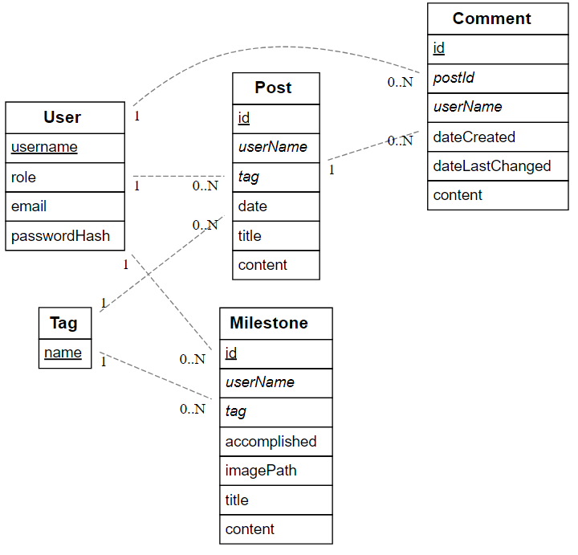
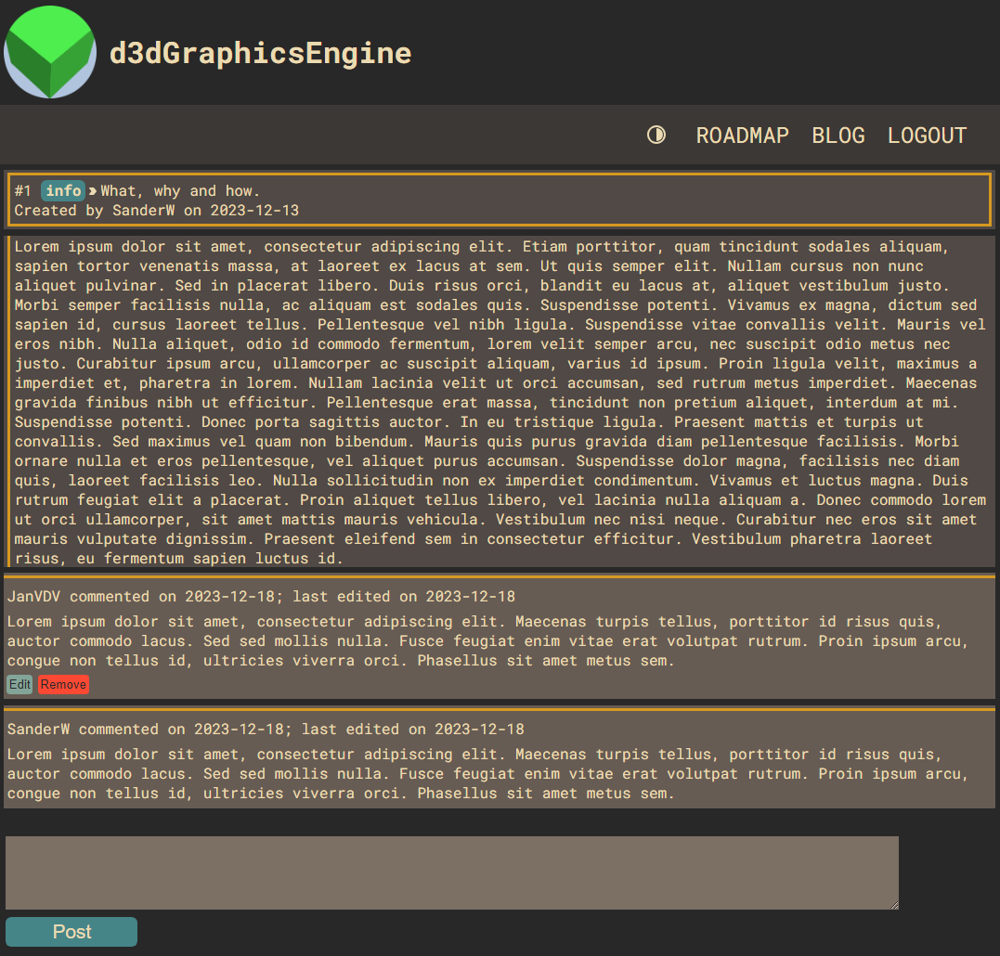
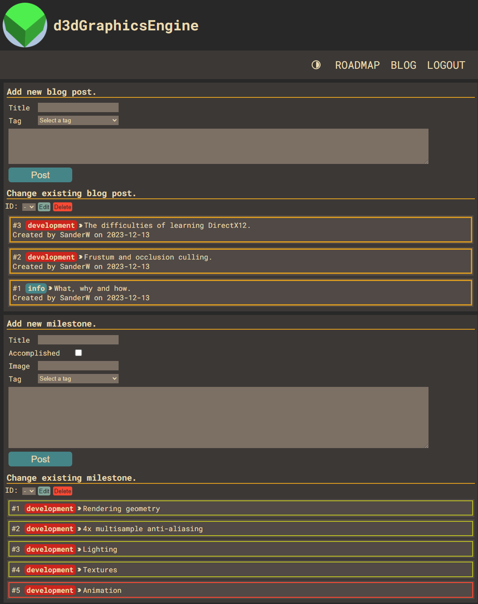
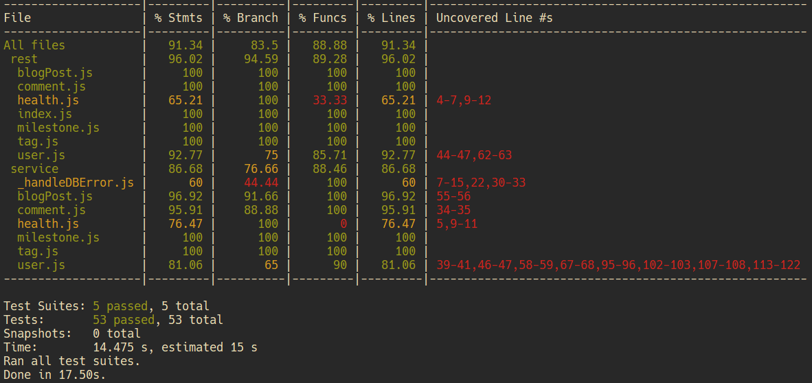

# Sander Wauters 202289024

-   [x] Front-end Web Development
    -   https://github.com/Web-IV/2324-frontendweb-SanderWauters.git
    -   https://two324-frontendweb-sanderwauters.onrender.com/
-   [x] Web Services:
    -   https://github.com/Web-IV/2324-webservices-SanderWauters.git
    -   https://two324-webservices-sanderwauters.onrender.com

**Logingegevens**

-   Gebruikersnaam: SanderW
    -   Wachtwoord: Server2022
    -   Role: ADMIN
-   Gebruikersnaam: JanVDV
    -   Wachtwoord: Server2022
    -   Role: USER

## Projectbeschrijving

De website is voor mijn hobbyproject, een 3D renderer, en bestaat uit een roadmap en een devblog. De roadmap bestaat uit milestones die een korte omschrijving geven van de features die al toegevoegd zijn of nog toegevoegd moeten worden. Op de devblog kunnen admins blogs posten en gebruikers die een account hebben en ingelogd zijn kunnen hierop comments achterlaten. Voor de stijl van de website wou ik dat het een retro minimalistische uitstraling had. Het kleuren palet dat ik hiervoor gebruikt heb, is gruvbox.

Er zijn momenteel twee rollen die een gebruiker kan hebben, USER en ADMIN. Users kunnen op blog posts comments plaatsen, bijwerken en verwijderen. Bijwerken en verwijderen kan een user uiteraard enkel op zijn eigen comments. De admins kunnen milestones, blog posts en comments posten verwijderen en bijwerken. Ze kunnen ook users verwijderen, maar dit enkel via een directe DELETE request naar de back-end. Admins hebben ook toegang tot het admin panel via https://two324-frontendweb-sanderwauters.onrender.com/admin. Hier kunnen ze milestones en blog posts toevoegen, bijwerken en verwijderen.

## Screenshots

Een blogpost, hier zijn we ingelogd als de gebruiker `JanVDV`. Deze gebruiker kan comments schrijven en zijn vorige comments wijzigen of verwijderen.

Het admin panel, enkel toegankelijk als gebruiker met de ADMIN rol via https://two324-frontendweb-sanderwauters.onrender.com/admin

## API calls

-   **BlogPost**
    -   `GET /api/blogPosts`
    -   `GET /api/blogPosts/:id`
    -   `POST /api/blogPosts`
    -   `PUT /api/blogPosts/:id`
    -   `DELETE /api/blogPosts/:id`
-   **Comment**
    -   `POST /api/comments`
    -   `PUT /api/comments/:id`
    -   `DELETE /api/comments/:id`
-   **healt checks**
    -   `GET /api/health/ping`
    -   `GET /api/health/version`
-   **Milestone**
    -   `GET /api/milstones`
    -   `POST /api/milstones`
    -   `PUT /api/milstones/:id`
    -   `DELETE /api/milstones/:id`
-   **Tag**
    -   `GET /api/tags`
-   **User**
    -   `GET /api/users`
    -   `GET /api/users/:username`
    -   `POST /api/users/login`
    -   `POST /api/users/register`
    -   `DELETE /api/users/:username`

## Behaalde minimumvereisten

### Front-end Web Development

-   **componenten**

    -   [x] heeft meerdere componenten - dom & slim (naast login/register)
    -   [x] applicatie is voldoende complex
    -   [x] definieert constanten (variabelen, functies en componenten) buiten de component
    -   [x] minstens één form met meerdere velden met validatie (naast login/register)
    -   [x] login systeem
             

-   **routing**

    -   [x] heeft minstens 2 pagina's (naast login/register)
    -   [x] routes worden afgeschermd met authenticatie en autorisatie
             

-   **state-management**

    -   [x] meerdere API calls (naast login/register)
    -   [x] degelijke foutmeldingen indien API-call faalt
    -   [x] gebruikt useState enkel voor lokale state
    -   [x] gebruikt gepast state management voor globale state - indien van toepassing
             

-   **hooks**

    -   [x] gebruikt de hooks op de juiste manier
             

-   **varia**

    -   [x] een aantal niet-triviale e2e testen
    -   [x] minstens één extra technologie
    -   [x] maakt gebruik van de laatste ES-features (async/await, object destructuring, spread operator...)
    -   [x] duidelijke en volledige README.md
    -   [x] volledig en tijdig ingediend dossier en voldoende commits

### Web Services

-   **datalaag**

    -   [x] voldoende complex (meer dan één tabel, 2 een-op-veel of veel-op-veel relaties)
    -   [x] één module beheert de connectie + connectie wordt gesloten bij sluiten server
    -   [x] heeft migraties - indien van toepassing
    -   [x] heeft seeds
             

-   **repositorylaag** (In dit project wordt er met een ORM gewerkt.)

    -   [n.v.t.] definieert één repository per entiteit (niet voor tussentabellen) - indien van toepassing
    -   [n.v.t.] mapt OO-rijke data naar relationele tabellen en vice versa - indien van toepassing
         

-   **servicelaag met een zekere complexiteit**

    -   [x] bevat alle domeinlogica
    -   [x] bevat geen SQL-queries of databank-gerelateerde code
             

-   **REST-laag**

    -   [x] meerdere routes met invoervalidatie
    -   [x] degelijke foutboodschappen
    -   [x] volgt de conventies van een RESTful API
    -   [x] bevat geen domeinlogica
    -   [x] geen API calls voor entiteiten die geen zin hebben zonder hun ouder (bvb tussentabellen)
    -   [x] degelijke authorisatie/authenticatie op alle routes
             

-   **algemeen**

    -   [x] er is een minimum aan logging voorzien
    -   [x] een aantal niet-triviale integratietesten (min. 1 controller >=80% coverage)
    -   [x] minstens één extra technologie
    -   [x] maakt gebruik van de laatste ES-features (async/await, object destructuring, spread operator...)
    -   [x] duidelijke en volledige README.md
    -   [x] volledig en tijdig ingediend dossier en voldoende commits

## Projectstructuur

### Front-end Web Development

-   **assets**: Bevat assets die gebruikt worden in dossier.md of de README.md
-   **cypress**: Bevat de end to end testen.
-   **src**: Bevat de source code van het project.
    -   **api**: Bevat de logica rond het versturen van API calls.
    -   **components**: Bevat alle componenten behalve de Root.
    -   **contexts**: Bevat alle contexten.
    -   **styles**: Bevat alles gerelateerd met css.

Wat extra uitleg over de `components` map.
Elke submap stelt een apart concept voor, en alle bestanden in die submap hebben
hoofdzakelijk iets te maken met dat concept. Heeft de component hoofdzakelijk iets te
maken met een blogpost dan staat het onder `blog`, iets met het beheer van de website
dan komt het onder `management`, wordt het zowat overal gebruikt, dan komt het onder `util`, etc.

### Web Services

-   **\_\_tests\_\_**: Bevat alles gerelateerd met testing.
    -   **common**: Bevat de testen die meerdere malen in ander bestanden voorkomen.
    -   **rest**: Bevat de testen voor de API calls.
-   **assets**: Bevat assets die gebruikt worden in dossier.md of de README.md
-   **config**: Bevat de configuratie bestanden.
-   **src**: Bevat de source code van het project.
    -   **core**: Bevat de functies die het geheel van de applicatie opbouwen.
    -   **data**: Bevat de code rond de ORM (Sequelize).
        -   **migrations**: Bevat de functies nodig om de migrations uit te voeren.
        -   **models**: Bevat de objecten die Sequelize gebruikt om queries uit te voeren op de databank. Elk object is een voorstelling van een tabel in de databank.
        -   **seeds**: Bevat de functies nodig om de databank te seeden.
    -   **rest**: Bevat de logica voor het ontvangen van requests.
    -   **service**: Bevat de business logica.

## Extra technologie

### Front-end Web Development

[Formik](https://www.npmjs.com/package/formik), een library dat het schrijven van forms vereenvoudigt. Het versimpelt het submitten van de form, de validatie en error handling.

Werking, we maken een `<Formik>` component aan. Als props geven we de initiële waarden mee van alle velden, een validatie schema en een functie die wordt aangeroepen als de gebruiker submit. Als children geven we de `From` component mee, deze bevat de elementen die de form opmaakt, `label`, `Field`, `button`, etc.

[Yup](https://www.npmjs.com/package/yup), een schema builder die ik in dit project gebruik voor invoer validatie in Fromik.

Werking, we roepen `Yup.object()` op voor een validation schema te maken. Dit krijgt als parameter een object mee waar elke property een chain van parsing actions en assertions meekrijgt. In dit project gebruiken geven
we dit schema mee aan de Formik `validationSchema` prop.

### Web Services

[Sequelize](https://www.npmjs.com/package/sequelize), een ORM die de applicatie verbind met de databank.

Werking, we instantiëren een `Sequelize` object genaamd `sequelize`. Met `sequelize.define("tableName", {rowInformation})` maken we vervolgens een object aan dat een tabel in de databank voorstelt. Dit object kunnen we nu gebruiken om queries uit te voeren op de databank, bvb. `user.findAll()` zal de query `SELECT * FROM user` uitvoeren en het resultaat teruggeven. 
Het uitvoeren van, onder andere, migrations en seeds gebeurt door gebruik van de `sequelize-cli` commandline tool. Het uitvoeren van migrations wordt gedaan via `npx sequelize-cli db:migrate` en seeds via `npx sequelize-cli db:seed:all`.

## Testresultaten

### Front-end Web Development

-   **Add comment**
    -   **Valid user**: We logen in als user.
        -   **should add a comment**: We voegen een comment toe en kijken of deze achteraan in de lijst van comments staat.
        -   **should edit the comment**: We wijzigen de comment die we in de vorige test hebben toegevoegd en kijken of dat deze comment is gewijzigd.
        -   **should remove the comment**: We verwijderen de comment die we in de eerste test hebben toegevoegd.
    -   **Invalid user**: We logen in als admin en voegen een comment toe. Daarna logen we in als user.
        -   **should not be able to edit the comment**: We kijken of dat de `edit` knop bestaat onder de comment die we hebben toegevoegd.
        -   **should not be able to remove the comment**: We kijken of dat de `remove` knop bestaat onder de comment die we hebben toegevoegd.
    -   **Not logged in**: We logen in als admin en voegen een comment toe. Daarna logen we ons uit.
        -   **should not be able to add a comment**: We kijken of dat de comment `textarea` en `submit` knop van de comment form bestaan.
        -   **should not be able to edit the comment**: We kijken of dat de `edit` knop bestaat.
        -   **should not be able to remove the comment**: We kijken of dat de `remove` knop bestaat.

### Web Services

-   **common**
    -   **test400ValidationFailed**: Krijgt een request met een geldig token mee. We verwachten dat de response een status code van `400` heeft en dat de body de code `VALIDATION_FAILED` bevat.
    -   **test401Unauthorized**: Krijgt een request zonder token mee, we sturen deze request eenmaal zo als ze is en vervolgens nog is, maar mat in ongeldige token. We verwachten dat de response een status code van `401` heeft en dat de body de code `UNAUTHORIZED` bevat.
    -   **test403Forbidden**: Krijgt een request met een geldig token mee. We verwachten dat de response een status code van `403` heeft en dat de body de code `FORBIDDEN` bevat.
    -   **test404NotFound**: Krijgt een request met een geldig token mee. We verwachten dat de response een status code van `404` heeft en dat de body de code `NOT_FOUND` bevat.
-   **GET**: Er wordt test data toegevoegd aan de databank. Vervolgens wordt er een GET request gestuurd voor deze data op te halen. We verwachten dat de response een status code van `200` heeft en dat de body alle test data bevat die we toegevoegd hebben.
-   **GET/:id**: Er wordt test data toegevoegd aan de databank. Eerst wordt er een GET request gestuurd voor een geldig id. We verwachten dat de response een status code van `200` heeft en dat de body de test data bevat die we hebben opgevraagd. Vervolgens roepen we `test404NotFound` op en geven we een request mee met een ongeldig. id.
-   **POST**: Er wordt een POST request gestuurd met een geldige body en token. We verwachten dat de response een status code van `201` heeft en dat de body de data bevat dat we hebben meegegeven. Vervolgens roepen we `test401Unauthorized` op en geven we dezelfde request mee, maar zonder token. En als laatste roepen we `test404NotFound` op voor een request die een ongeldige foreign key bevat.
-   **PUT/:id**: Er wordt test data toegevoegd aan de databank. Eerst wordt er een PUT request gestuurd met een geldige body, id en token. We verwachten dat de response een status code van `200` heeft en dat de body de data aangepaste data bevat. Vervolgens roepen we `test401Unauthorized` op en geven we dezelfde request mee, maar zonder token. En als laatste roepen we `test404NotFound` op, eerst voor een request met een ongeldige id en nogmaals voor een request die een ongeldige foreign key bevat.
-   **DELETE/:id**: Er wordt test data toegevoegd aan de databank. Eerst wordt er een DELETE request gestuurd met een geldige id en token. We verwachten dat de response een status code van `204` en dat de body leeg is. Vervolgens roepen we `test401Unauthorized` op en geven we dezelfde request mee, maar zonder token. En als laatste roepen we `test404NotFound` op voor een request met een ongeldige id.

## Gekende bugs

### Front-end Web Development

### Web Services

-   Sequelize geeft een `Deprecation warning` bij het aanmaken of aanpassen van kolommen met het `DATEONLY` datatype gevolgd door een error in `Function.createFromInputFallback (C:\...\node_modules\moment\moment.js:324:25)`. De huidige workaround is het `DATEONLY` type vervangen door `STRING`, behalve in de migrations en de databank.
